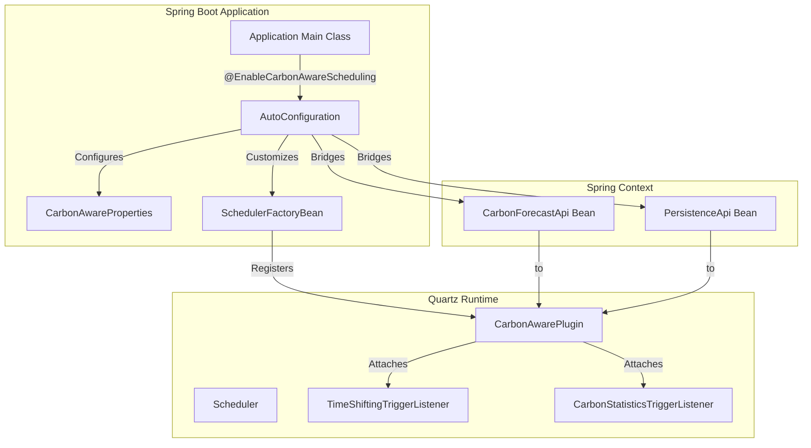

# Architecture Design Document: Spring Boot Carbon-Aware Quartz

This document provides a high-level overview of the `spring-boot-ca-quartz` module's architecture and its integration with the Spring Boot ecosystem and the core `quartz` library.

## 1. System Overview

The `spring-boot-ca-quartz` module acts as a bridge between the standard Spring Boot Quartz auto-configuration and the core carbon-aware Quartz functionality provided by the `quartz` module.

## 2. Key Components

### 2.1 Activation Logic
See [specs/01_activation.md](specs/01_activation.md) for activation conditions and gating by `@EnableCarbonAwareScheduling` and `carbon.aware.scheduling.enabled`.

### 2.2 Integration via `SchedulerFactoryBeanCustomizer`
See [specs/03_quartz_integration.md](specs/03_quartz_integration.md) for how the starter customizes the `SchedulerFactoryBean`, registers `CarbonAwarePlugin`, and attaches listeners.

### 2.3 Bridging Strategy
See [specs/04_dependency_management.md](specs/04_dependency_management.md) for bean selection precedence and the Spring-to-Quartz bridging approach.

### 2.4 Component Lifecycle
1.  **Context Boot**: Spring loads `CarbonAwareProperties` and scans for API beans.
2.  **Customization**: `CarbonAwareSchedulerCustomizer` runs, configuring the `SchedulerFactoryBean`.
3.  **Quartz Start**: Quartz initializes the `CarbonAwarePlugin`.
4.  **Plugin Initialization**: The plugin attaches listeners and (if enabled) initializes the `EnergyChartsForecastProvider`.
5.  **Runtime**: Listeners intercept trigger fires and execute time-shifting or statistics recording logic.

## 3. Data Flow

### 3.1 Configuration Flow
`application.yml` -> `CarbonAwareProperties` -> `CarbonAwareSchedulerCustomizer` -> `Quartz Properties` -> `CarbonAwarePlugin`.

### 3.2 Dependency Resolution Flow
Spring Context -> `CarbonAwareSchedulingAutoConfiguration` -> Selection Logic (Primary/Property/Auto) -> Resolved Bean Name/Class -> `CarbonAwarePlugin`.

## 4. Resilience and Error Handling
- **Graceful Degradation**: If the forecast provider is unavailable, the `TimeShiftingTriggerListener` defaults to immediate execution (standard Quartz behavior).
- **Startup Safety**: If multiple API beans are found without a clear `@Primary` or property-based override, the application fails to start with a descriptive error message to prevent ambiguous scheduling behavior.

## 5. Technology Stack
- **Base**: Java 17, Spring Boot 3.4.1+, Quartz 2.5.0.
- **Dependencies**: `spring-boot-starter-quartz`, `spring-boot-autoconfigure`, `spring-boot-configuration-processor`.
